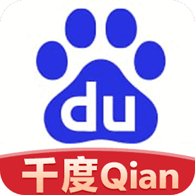

# 关于一个叫千度导航发布页的页面升级以及优化

# 千度导航地址发布页分析

## 优点：
1. **简洁明了**：
   页面内容简单、直观，用户可以迅速找到需要的信息（即多个网址地址）。

2. **图像和文本结合**：
   使用了公司或品牌的 logo 图片，这有助于提升页面的品牌识别度。

3. **响应式设计**：
   `<meta name="viewport" content="width=device-width, initial-scale=1">` 确保了页面在移动设备上的适应性，增强了用户体验。

4. **清晰的链接展示**：
   所有的地址都使用了可点击的链接，且链接目标设置为 `target="_blank"`，可以在新窗口打开，避免打断用户的当前页面体验。

5. **背景色区分**：
   通过不同的背景色（如 `#da634b` 和 `#00CD00`）对不同部分的内容进行了视觉上的区分，使页面看起来有层次感。

6. **基础 SEO**：
   页面有设置 `meta description` 和 `meta keywords`，这有助于搜索引擎对页面的索引。

## 可优化点：
1. **过时的 XHTML 和不必要的 `DOCTYPE`**：
   使用的 `XHTML` 规范较为陈旧（`XHTML 1.0 Transitional`），现在更推荐使用 `HTML5`。可以直接使用 `<DOCTYPE html>`，并删除不必要的 `xmlns` 属性。

2. **页面内嵌 CSS 的使用**：
   当前的样式使用了内嵌的 CSS，这样不利于页面的维护与性能优化。可以将 CSS 移到外部样式表文件，提升页面加载速度并便于管理。
   例如：
   ```html
   <link rel="stylesheet" href="styles.css">
   
3. **字体设置不规范：**
页面中字体大小的设置没有统一的规范，部分地方使用了 font-size: 30px，可能对某些设备和屏幕分辨率不够友好。最好设置统一的响应式字体大小，或者使用相对单位（如 em, rem）。

例如：body {
    font-size: 1rem;  /* 以根元素字体大小为基准 */
}

4.**缺少页面的可访问性优化：**
页面没有设置任何 alt 属性的图片描述，这对于视力障碍用户或屏幕阅读器的支持不够。建议在  标签中加入适当的 alt 属性，例如：

5.**避免使用 oncontextmenu="return false"：**
禁用右键菜单可能会让部分用户体验受到影响，尤其是在需要使用右键的场景。尽量避免使用这一禁用行为，除非是出于防止盗图等特定需求。

6.**不必要的表格布局：**
使用 <table> 布局来控制页面结构现在已经过时，现代网页开发中更推荐使用 CSS Flexbox 或 Grid 布局。这样不仅代码更简洁、清晰，也有助于提高页面的响应性和可维护性。

7.**内容布局问题：**
在网址地址部分，内容的排版过于紧凑。可以通过添加间距（margin 或 padding）来让内容显得更整齐、易读。
例如：.abc {
    margin-bottom: 10px;
}

8.**版权声明文字过于简单：**
版权声明使用了较为简单的文字，并且没有设置任何样式。可以通过修改字体样式、增加分隔线或背景色来增强视觉效果。

9.**链接的 nofollow 属性的使用：**
rel="external nofollow" 用于禁止搜索引擎抓取这些链接，通常适用于广告或外部链接。考虑一下这些链接是否真的需要 nofollow，如果这些链接是你的站点重要内容的一部分，或许可以去掉这个属性。
改进后的代码示例：
```
<!DOCTYPE html>
<html lang="zh">
<head>
  <meta charset="UTF-8">
  <meta name="viewport" content="width=device-width, initial-scale=1">
  <title>千度导航地址发布页</title>
  <meta name="keywords" content="千度导航官网">
  <meta name="description" content="千度导航致力于做一个有趣好玩好看的导航网址">
  <link rel="icon" href="static/picture/favicon.ico" type="image/x-icon">
  <link rel="stylesheet" href="styles.css">
</head>
<body>

  <div class="container">
    <header>
      
    </header>

    <section class="info">
      <p>收藏千度导航地址发布页或者发送任意邮件到 88cang@gmail.com, 自动回复最新地址</p>
    </section>

    <section class="links">
      <h2>地址一：</h2>
      <ul>
        <li><a href="https://qq.baidu.top/123/" target="_blank">qq.baidu.top/123</a></li>
        <li><a href="https://qq.baidu.top/123/" target="_blank">qq.baidu.top/123</a></li>
        <li><a href="https://qq.baidu.top/123/" target="_blank">qq.baidu.top/123</a></li>
      </ul>
    </section>

    <footer>
      <p>本站所提供一切资料只用于资讯参考，用户必须遵守当地法律规定，不得进行任何非法活动。</p>
      <p>All rights Reserved. 千度导航版权所有！</p>
    </footer>
  </div>

</body>
</html>
```
